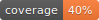

#  Denser Retriever

<div align="center">

<!-- [](https://github.com/denser-org/denser-retriever/actions?query=workflow%3Abuild) -->

[](https://pypi.org/project/denser-retriever/)
[](https://github.com/denser-org/denser-retriever/pulls?utf8=%E2%9C%93&q=is%3Apr%20author%3Aapp%2Fdependabot)

[](https://github.com/astral-sh/ruff)
[](https://github.com/PyCQA/bandit)
[](https://github.com/denser-org/denser-retriever/blob/main/.pre-commit-config.yaml)
[](https://github.com/denser-org/denser-retriever/releases)
[](https://github.com/denser-org/denser-retriever/blob/main/LICENSE)


Enterprise-grade AI retriever solution that seamlessly integrates to enhance your AI applications.

</div>

## 📝 Description

The Denser Retriever project is set to establish a unified and extensive Retriever hub. This hub will not only incorporate the vector database, which is optimized for recall, but also integrate traditional keyword-based search methods, optimized for precision, along with alternatives like ML rerankers. Our goal is to deliver an Enterprise-grade AI retriever solution that seamlessly integrates to enhance your AI applications.

## 📃 Documentation

The official documentation is hosted on [retriever.denser.ai](https://retriever.denser.ai).

## 🚀 Features

The initial release of Denser Retriever provides the following features.

- Including various retrievers such as keyword search, vector search, hybrid, and optionally with a ML reranker
- Providing step-by-step guidance to setup keyword and vector search services (elasticsearch and milvus), which are utilized to support various retrievers
- Benchmarking on MTEB datasets with different retrievers to assess the quality of various retrievers
- A unified framework for both passage and long documents retrieval tasks
- Demonstrating how to use Denser retriever to power an end-to-end AI chat application

## 📦 Installation

You can install the latest version of Denser Retriever from PyPI with the following command:

```bash
pip install denser-retriever
```

## 👨🏼‍💻 Development

You can start developing Denser Retriever on your local machine.

See [DEVELOPMENT.md](DEVELOPMENT.md) for more details.

## 📈 Releases

You can see the list of available releases on the [GitHub Releases](https://github.com/denser-org/denser-retriever/releases) page.

We follow [Semantic Versions](https://semver.org/) specification.

We use [`Release Drafter`](https://github.com/marketplace/actions/release-drafter). As pull requests are merged, a draft release is kept up-to-date listing the changes, ready to publish when you’re ready. With the categories option, you can categorize pull requests in release notes using labels.

### List of labels and corresponding titles

|               **Label**               |  **Title in Releases**  |
| :-----------------------------------: | :---------------------: |
|       `enhancement`, `feature`        |       🚀 Features       |
| `bug`, `refactoring`, `bugfix`, `fix` | 🔧 Fixes & Refactoring  |
|       `build`, `ci`, `testing`        | 📦 Build System & CI/CD |
|              `breaking`               |   💥 Breaking Changes   |
|            `documentation`            |    📝 Documentation     |
|            `dependencies`             | ⬆️ Dependencies updates |

You can update it in [`release-drafter.yml`](https://github.com/denser-org/denser-retriever/blob/main/.github/release-drafter.yml).

GitHub creates the `bug`, `enhancement`, and `documentation` labels for you. Dependabot creates the `dependencies` label. Create the remaining labels on the Issues tab of your GitHub repository, when you need them.

## 🛡 License

[](https://github.com/denser-org/denser-retriever/blob/main/LICENSE)

This project is licensed under the terms of the `MIT` license. See [LICENSE](https://github.com/denser-org/denser-retriever/blob/main/LICENSE) for more details.

## 📃 Citation

```bibtex
@misc{denser-retriever,
  author = {denser-org},
  title = {Enterprise-grade AI retriever solution that seamlessly integrates to enhance your AI applications.},
  year = {2024},
  publisher = {GitHub},
  journal = {GitHub repository},
  howpublished = {\url{https://github.com/denser-org/denser-retriever}}
}
```
