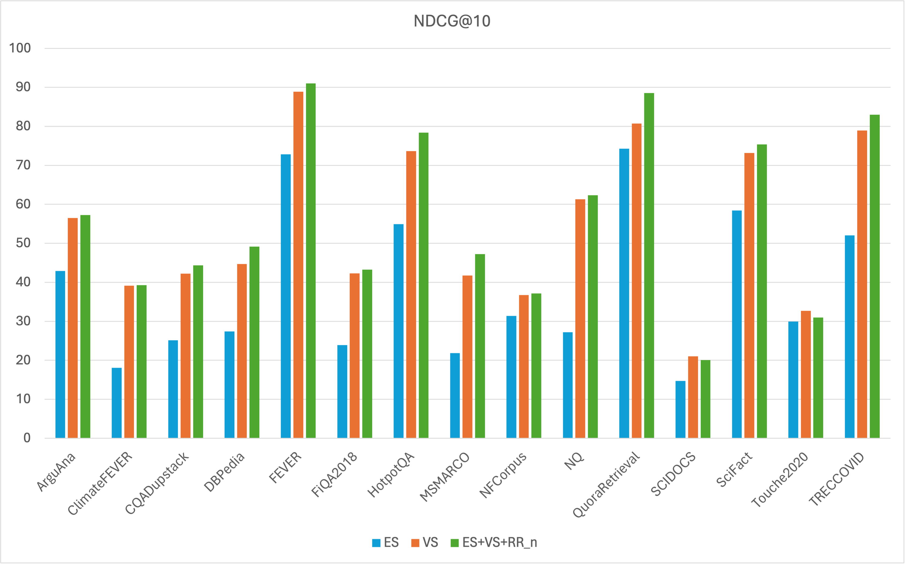

#  Denser Retriever

<div align="center">

<!-- [](https://github.com/denser-org/denser-retriever/actions?query=workflow%3Abuild) -->

[](https://pypi.org/project/denser-retriever/)
[](https://github.com/denser-org/denser-retriever/pulls?utf8=%E2%9C%93&q=is%3Apr%20author%3Aapp%2Fdependabot)

[](https://github.com/astral-sh/ruff)
[](https://github.com/PyCQA/bandit)
[](https://github.com/denser-org/denser-retriever/blob/main/.pre-commit-config.yaml)
[](https://github.com/denser-org/denser-retriever/releases)
[](https://github.com/denser-org/denser-retriever/blob/main/LICENSE)


An enterprise-grade AI retriever designed to streamline AI integration into your applications, ensuring cutting-edge accuracy.

</div>

## 📝 Description

Denser Retriever combines multiple search technologies into a single platform. It utilizes **gradient boosting (
xgboost)** machine learning technique to combine:

- **Keyword-based searches** that focus on fetching precisely what the query mentions.
- **Vector databases** that are great for finding a wide range of potentially relevant answers.
- **Machine Learning rerankers** that fine-tune the results to ensure the most relevant answers top the list.

Our experiments on MTEB datasets show that the combination of keyword search, vector search and a reranker via an xgboost model (denoted as ES+VS+RR_n) can significantly improve the vector search (VS) baseline.




## 🚀 Features

The initial release of Denser Retriever provides the following features.

- Supporting heterogeneous retrievers such as **keyword search**, **vector search**, and **ML model reranking**
- Leveraging **xgboost** ML technique to effectively combine heterogeneous retrievers
- **State-of-the-art accuracy** on [MTEB](https://github.com/embeddings-benchmark/mteb) Retrieval benchmarking
- Demonstrating how to use Denser retriever to power an **end-to-end applications** such as chatbot and semantic search

## 📦 Installation

We use [Poetry](https://python-poetry.org/docs/) to install and manage Denser Retriever package. We install Denser
Retriever with the following command under repo root directory.

```bash
git clone https://github.com/denser-org/denser-retriever
cd denser-retriever
make install
```

More details can be found the
DEVELOPMENT [doc](https://github.com/denser-org/denser-retriever/blob/main/DEVELOPMENT.md).

## 📃 Documentation

The official documentation is hosted on [retriever.denser.ai](https://retriever.denser.ai).
Click [here](https://retriever.denser.ai/docs/quick-start) to get started.

## 👨🏼‍💻 Development

You can start developing Denser Retriever on your local machine.

See [DEVELOPMENT.md](DEVELOPMENT.md) for more details.

## 🛡 License

[](https://github.com/denser-org/denser-retriever/blob/main/LICENSE)

This project is licensed under the terms of the `MIT` license.
See [LICENSE](https://github.com/denser-org/denser-retriever/blob/main/LICENSE) for more details.

## 📃 Citation

```bibtex
@misc{denser-retriever,
  author = {denser-org},
  title = {An enterprise-grade AI retriever designed to streamline AI integration into your applications, ensuring cutting-edge accuracy.},
  year = {2024},
  publisher = {GitHub},
  journal = {GitHub repository},
  howpublished = {\url{https://github.com/denser-org/denser-retriever}}
}
```
