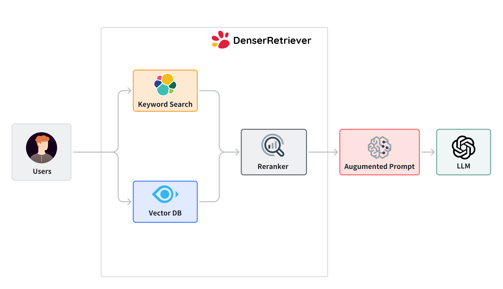

<Callout type="info">
  We run this experiment on a **localhost** as it does not require intensive computations. We need to install ES and Milvus as specified [here](../install/install-local).
</Callout>

In index and query use case, users provide a collection of documents such as text files or webpages to build a retriever. Users can then ask questions to obtain relevant results from the provided documents. The code for this use case is at [index_and_query_from_docs.py](https://github.com/denser-org/denser-retriever/blob/main/experiments/index_and_query_from_docs.py). To run this use case, go to denser-retriever repo and run the following command

```bash
poetry run python experiments/index_and_query_from_docs.py
```
If the run is successful, we would expect to see something similar to the following.

```bash
2024-05-27 12:00:55 INFO: ES ingesting passages.jsonl record 96
2024-05-27 12:00:55 INFO: Done building ES index
2024-05-27 12:00:55 INFO: Remove existing Milvus index state_of_the_union
2024-05-27 12:00:59 INFO: Milvus vector DB ingesting passages.jsonl record 96
2024-05-27 12:01:03 INFO: Done building Vector DB index
[{'source': 'tests/test_data/state_of_the_union.txt',
'text': 'One of the most serious constitutional responsibilities...',
'title': '', 'pid': 73,
'score': -1.6985594034194946}]
```

## Build and query a retriever from a text file

### Overview

The index and query use case consists of two steps:

1. Build a denser retriever from a text file or a webpage.
2. Query a retriever to obtain relevant results.

To support additional types of files such as PDF, users can refer to LangChain [file loaders](https://js.langchain.com/v0.1/docs/integrations/document_loaders/file_loaders/).

The following diagram illustrates a denser retriever, which consists of three components:



- **Keyword search** relies on traditional search techniques that use exact keyword matching. We use [elasticsearch](https://www.elastic.co/guide/en/elasticsearch/reference/current/targz.html) in denser retriever.
- **Vector search** uses neural network models to encode both the query and the documents into dense vector representations in a high-dimensional space. We use [Milvus](https://milvus.io/docs/install_standalone-docker.md) and [snowflake-arctic-embed-m](https://github.com/Snowflake-Labs/arctic-embed?tab=readme-ov-file) model, which achieves state-of-the-art performance on the MTEB/BEIR [leaderboard](https://huggingface.co/spaces/mteb/leaderboard) for each of their size variants.
- **A ML cross-encoder re-ranker** can be utilized to further boost accuracy over these two retriever approaches above. We use [cross-encoder/ms-marco-MiniLM-L-6-v2](https://huggingface.co/cross-encoder/ms-marco-MiniLM-L-6-v2), which has a good balance between accuracy and inference latency.

In the following section, we will explain the underlying processes and mechanisms involved.

<Steps>

<Step>

### Prepare the config file

We config the above three components in the following yaml file (available at [repo](https://github.com/denser-org/denser-retriever/blob/main/experiments/config_local.yaml)). Most of the parameters are self-explanatory. The sections of `keyword`, `vector`, `rerank` config the Elasticsearch, Milvus, and reranker respectively.

We uses **combine: model** to combine Elasticsearch, Milvus and reranker via a [xgboost](https://github.com/dmlc/xgboost) model **experiments/models/msmarco_xgb_es+vs+rr_n.json**, which was trained using mteb [msmarco](https://huggingface.co/datasets/mteb/msmarco) dataset (see the [training](https://retriever.denser.ai/docs/experiments/training) recipe on how to train such a model). Besides the model combination, we can also use **linear** or **rank** to combine Elasticsearch, Milvus and reranker. The experiments on MTEB datasets suggest that the model combination can lead to significantly higher accuracy than the linear or rank methods.

Some parameters, for example, `es_ingest_passage_bs`, are only used in training a xgboost model (i.e. not needed in query stage).

```yaml
version: "0.1"

# linear, rank or model
combine: model
keyword_weight: 0.5
vector_weight: 0.5
rerank_weight: 0.5
model: ./experiments/models/msmarco_xgb_es+vs+rr_n.json
model_features: es+vs+rr_n

keyword:
  es_user: elastic
  es_passwd: YOUR_ES_PASSWORD
  es_host: http://localhost:9200
  es_ingest_passage_bs: 5000
  topk: 100

vector:
  milvus_host: localhost
  milvus_port: 19530
  milvus_user: root
  milvus_passwd: Milvus
  emb_model: Snowflake/snowflake-arctic-embed-m
  emb_dims: 768
  one_model: false
  vector_ingest_passage_bs: 2000 # 1000
  topk: 100

rerank:
  rerank_model: cross-encoder/ms-marco-MiniLM-L-6-v2
  rerank_bs: 100
  topk: 100

output_prefix: ./denser_output_retriever/

max_doc_size: 0
max_query_size: 10000
```

</Step>

<Step>

### Generate passages

We now describe how to build a retriever from a given text file: the [state_of_the_union.txt](https://github.com/denser-org/denser-retriever/blob/main/tests/test_data/state_of_the_union.txt). The following code shows how to read the text file, split the file to text chunks and save them to a jsonl file `passages.jsonl`.

```python
from langchain_community.document_loaders import TextLoader
from langchain_text_splitters import RecursiveCharacterTextSplitter
from denser_retriever.utils import save_HF_docs_as_denser_passages
from denser_retriever.retriever_general import RetrieverGeneral

# Generate text chunks
documents = TextLoader("tests/test_data/state_of_the_union.txt").load()
text_splitter = RecursiveCharacterTextSplitter(chunk_size=500, chunk_overlap=100)
texts = text_splitter.split_documents(documents)
passage_file = "passages.jsonl"
save_HF_docs_as_denser_passages(texts, passage_file, 0)
```

Each line in `passages.jsonl` is a passage, which contains fields of `source`, `title`, `text` and `pid` (passage id).

```json
{"source": "tests/test_data/state_of_the_union.txt",
"title": "",
"text": "Madam Speaker, Madam Vice President, our First Lady and Second Gentleman. Members of Congress and the Cabinet. Justices of the Supreme Court. My fellow Americans.  \n\nLast year COVID-19 kept us apart. This year we are finally together again. \n\nTonight, we meet as Democrats Republicans and Independents. But most importantly as Americans. \n\nWith a duty to one another to the American people to the Constitution. \n\nAnd with an unwavering resolve that freedom will always triumph over tyranny.",
"pid": 0}
```

</Step>

<Step>

### Build a Denser retriever

We can build a Denser retriever with the given `passages.jsonl` and `experiments/config_local.yaml` config file.

```python
# Build denser index
retriever_denser = RetrieverGeneral("state_of_the_union", "experiments/config_local.yaml")
retriever_denser.ingest(passage_file)
```

</Step>

<Step>

### Query a Denser retriever
We can simply use the following code to query a retriever to obtain relevant passages.

```python
# Query
query = "What did the president say about Ketanji Brown Jackson"
passages, docs = retriever_denser.retrieve(query, {})
print(passages)
```

Each returned passage receives a confidence `score` to indicate how relevant it is to the given query. We get something similar to the following.

```python
[{'source': 'tests/test_data/state_of_the_union.txt',
'text': 'One of the most serious constitutional responsibilities a President has is nominating someone to serve on the United States Supreme Court. \n\nAnd I did that 4 days ago, when I nominated Circuit Court of Appeals Judge Ketanji Brown Jackson. One of our nation’s top legal minds, who will continue Justice Breyer’s legacy of excellence.',
'title': '',
'pid': 73,
'score': -0.6116511225700378}]
```

</Step>

<Step>

### Put everything together
We put all code together as follows. The code is also available at [repo](https://github.com/denser-org/denser-retriever/blob/main/experiments/index_and_query_from_docs.py).
```python
from langchain_community.document_loaders import TextLoader
from langchain_text_splitters import RecursiveCharacterTextSplitter
from denser_retriever.utils import save_HF_docs_as_denser_passages
from denser_retriever.retriever_general import RetrieverGeneral

# Generate text chunks
documents = TextLoader("tests/test_data/state_of_the_union.txt").load()
text_splitter = RecursiveCharacterTextSplitter(chunk_size=500, chunk_overlap=100)
texts = text_splitter.split_documents(documents)
passage_file = "passages.jsonl"
save_HF_docs_as_denser_passages(texts, passage_file, 0)

# Build denser index
retriever_denser = RetrieverGeneral("state_of_the_union", "experiments/config_local.yaml")
retriever_denser.ingest(passage_file)

# Query
query = "What did the president say about Ketanji Brown Jackson"
passages, docs = retriever_denser.retrieve(query, {})
print(passages)
```

</Step>

</Steps>

## Build and query a retriever from a webpage

Building a retriever from a webpage is similar to the above, except for the passage corpus generation. The **index_and_query_from_webpage.py** source code can be found at [here](https://github.com/denser-org/denser-retriever/blob/main/experiments/index_and_query_from_webpage.py).

To run this use case, go to denser-retriever repo and run:

```bash
poetry run python experiments/index_and_query_from_webpage.py
```

If successful, we expect to see somthing similar to the following.

```bash
2024-05-27 12:10:47 INFO: ES ingesting passages.jsonl record 66
2024-05-27 12:10:47 INFO: Done building ES index
2024-05-27 12:10:52 INFO: Milvus vector DB ingesting passages.jsonl record 66
2024-05-27 12:10:56 INFO: Done building Vector DB index
[{'source': 'https://lilianweng.github.io/posts/2023-06-23-agent/',
'text': 'Fig. 1. Overview of a LLM-powered autonomous agent system...',
'title': '',
'pid': 2,
'score': -1.6985594034194946}]
