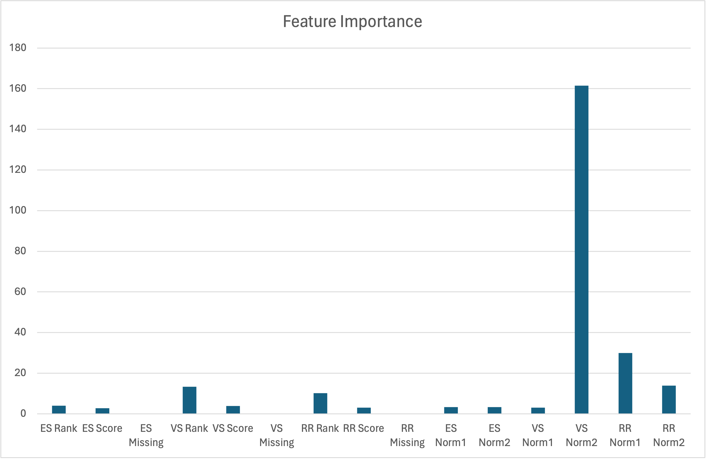

<Callout type="info">
  We run this experiment on a **server**, which requires ES and Milvus installations specified [here](/docs/install/install-server).
</Callout>

In training use case, users provide a training dataset to train a [xgboost](https://github.com/dmlc/xgboost) model which governs on how to combine keyword search, vector search and reranking. A training set consists of three components:

1. A query set
2. A passage corpus
3. A qrels file which annotates the relevance of passages for queries

The source code for this use case can be found at [train_and_test.py](https://github.com/denser-org/denser-retriever/blob/main/experiments/train_and_test.py). The training command usage is:

 ```bash
 python train_and_test.py [config_file] [dataset_name] [train] [test]
 ```
We use the [mteb/scifact](https://huggingface.co/datasets/mteb/scifact) dataset to illustrate the use case:

```bash
poetry run python experiments/train_and_test.py experiments/config_server.yaml mteb/scifact train test
```
That is, we use experiments/[config_server.yaml](https://github.com/denser-org/denser-retriever/blob/main/experiments/config_server.yaml) as the config file (we need to configure hosts, users and passwords for Elasticsearch and Milvus), use `mteb/scifact` dataset, use the `train` split to train a xgboost model and test the trained model on `test` split data. If successful, we would get similar result as the following.
```bash
INFO:__main__:train: train, eval: test, cross-validation: False
metric_keyword.json: "NDCG@10": 0.58425,
metric_vector.json: "NDCG@10": 0.73167,
metric_es+vs.json: "NDCG@10": 0.73288,
metric_es+rr.json: "NDCG@10": 0.69086,
metric_vs+rr.json: "NDCG@10": 0.72731,
metric_es+vs+rr.json: "NDCG@10": 0.73081,
metric_es+vs_n.json: "NDCG@10": 0.75084,
metric_es+rr_n.json: "NDCG@10": 0.69692,
metric_vs+rr_n.json: "NDCG@10": 0.73625,
metric_es+vs+rr_n.json: "NDCG@10": 0.75335
```
We explain the experiments in the following steps.

## Generate retriever data

We need to generate featurized query passage data to train xgboost models. The following table shows the mteb/scifact statistics. The dataset has 5,183 passages, 809 and 300 training and test queries. For each query, each passage in the corpus receives a relevance label, with 0 and 1 being irrelevant and relevant respectively.

| #Corpus | #Train Query | #Test Query|
|---|---|---|
|5,183 | 809| 300|

We first build an Elasticsearch index, a vector index and a reranker using scifact passages. The Elasticsearch, vector search and reranker settings are configured in [config_server.yaml](https://github.com/denser-org/denser-retriever/blob/main/experiments/config_server.yaml).

- For vector search, we use [snowflake-arctic-embed-m](https://github.com/Snowflake-Labs/arctic-embed?tab=readme-ov-file) model, which achieves state-of-the-art performance on the MTEB/BEIR [leaderboard](https://huggingface.co/spaces/mteb/leaderboard) for each of their size variants.
- For ML reranker, we use [cross-encoder/ms-marco-MiniLM-L-6-v2](https://huggingface.co/cross-encoder/ms-marco-MiniLM-L-6-v2), which has a good balance between accuracy and inference latency.

The Denser retriever is illustrated in the following diagram, with the top and bottom boxes describing the training and inference respectively. For each query in the training data, we query Elasticsearch and vector database to retrieve two sets of topk (100) passages respectively. We note that these two sets may overlap. We then apply a ML reranker to rerank the passages returned from Elasticsearch and vector search.

import RagFlowData from './rag-flow-data.png'

<ImageZoom src={RagFlowData} alt="Denser Retriever" className="border border-dashed rounded-md" />

Let's consider a query and two passages in the following. The first passage is annotated with label 1 (relevant) while the second is 0 (irrelevant).

- Query
```python
{"id": "3", "text": "1,000 genomes project enables mapping of genetic sequence variation consisting of rare variants with larger penetrance effects than common variants."}
```

- Passages
```json
{"source": "14717500", "title": "Rare Variants Create Synthetic Genome-Wide Associations", "text": "Genome-wide association studies (GWAS) have now identified at least 2,000 common variants that appear associated with common diseases or related traits (http://www.genome.gov/gwastudies), hundreds of which have been convincingly replicated. It is generally thought that the associated markers reflect the effect of a nearby common (minor allele frequency >0.05) causal site, which is associated with the marker, leading to extensive resequencing efforts to find causal sites. We propose as an alternative explanation that variants much less common than the associated one may create \"synthetic associations\" by occurring, stochastically, more often in association with one of the alleles at the common site versus the other allele. Although synthetic associations are an obvious theoretical possibility, they have never been systematically explored as a possible explanation for GWAS findings. Here, we use simple computer simulations to show the conditions under which such synthetic associations will arise and how they may be recognized. We show that they are not only possible, but inevitable, and that under simple but reasonable genetic models, they are likely to account for or contribute to many of the recently identified signals reported in genome-wide association studies. We also illustrate the behavior of synthetic associations in real datasets by showing that rare causal mutations responsible for both hearing loss and sickle cell anemia create genome-wide significant synthetic associations, in the latter case extending over a 2.5-Mb interval encompassing scores of \"blocks\" of associated variants. In conclusion, uncommon or rare genetic variants can easily create synthetic associations that are credited to common variants, and this possibility requires careful consideration in the interpretation and follow up of GWAS signals.", "pid": -1}
{"source": "4414547", "title": "Mosaic PPM1D mutations are associated with predisposition to breast and ovarian cancer", "text": "Improved sequencing technologies offer unprecedented opportunities for investigating the role of rare genetic variation in common disease. However, there are considerable challenges with respect to study design, data analysis and replication. Using pooled next-generation sequencing of 507 genes implicated in the repair of DNA in 1,150 samples, an analytical strategy focused on protein-truncating variants (PTVs) and a large-scale sequencing case–control replication experiment in 13,642 individuals, here we show that rare PTVs in the p53-inducible protein phosphatase PPM1D are associated with predisposition to breast cancer and ovarian cancer. PPM1D PTV mutations were present in 25 out of 7,781 cases versus 1 out of 5,861 controls (P = 1.12 × 10−5), including 18 mutations in 6,912 individuals with breast cancer (P = 2.42 × 10−4) and 12 mutations in 1,121 individuals with ovarian cancer (P = 3.10 × 10−9). Notably, all of the identified PPM1D PTVs were mosaic in lymphocyte DNA and clustered within a 370-base-pair region in the final exon of the gene, carboxy-terminal to the phosphatase catalytic domain. Functional studies demonstrate that the mutations result in enhanced suppression of p53 in response to ionizing radiation exposure, suggesting that the mutant alleles encode hyperactive PPM1D isoforms. Thus, although the mutations cause premature protein truncation, they do not result in the simple loss-of-function effect typically associated with this class of variant, but instead probably have a gain-of-function effect. Our results have implications for the detection and management of breast and ovarian cancer risk. More generally, these data provide new insights into the role of rare and of mosaic genetic variants in common conditions, and the use of sequencing in their identification.", "pid": -1}
```

 For Elasticsearch (ES), vector search (VS) and Reranker (RR), we generate three features: `rank`, `score` and `missing` on a query passage pair. We list the featurized query and passage pairs in the following table.

  |QID |PID | Label | ES Rank | ES Score | ES Missing | VS Rank | VS Score | VS Missing| RR Rank | RR Score | RR Missing
| ---- |--- | ------ | ----------- | ---- |  ---- | ----------- | ---- |  ---- | ----------- | ---- |---- |
| 3 |14717500 |1 | 3 | 74.42| 0| 5| -1.29| 0| 1| 2.98| 0 |
| 3 |4414547 |0 | 29 | 32.08| 0| 4| -1.28| 0| 2| 1.47| 0 |

 The first data point represents the query and passage `14717500`. The passage is annotated with label `1` (relevant) with respect to the query. The passage receives rank position of `3` and relevance score of `74.42` in Elasticsearch retriever. It is ranked in the top 100 passages from Elasticsearch and thus is not missing (ES Missing value of `0`). Similarly the passage receives rank position of `5` and score `-1.29` from vector search. We note both Elasticsearch and vector search top 100 passages are reranked by a reranker, so the reranker missing feature is always `0`.


We now have featurized query passage training (138,322) and test (51,601) data from scifact dataset.

## Compute baselines

For Elasticsearch, the topk passages per query are sorted in the descending order of Elasticsearch scores to compute its ndcg@10 score. Vector search ndcg@10 can be computed similarly with the vector scores. We list the baseline ndcg@10 scores in the following table.

| | Elasticsearch | Vector Search|
|---|---|---|
|ndcg@10 | 58.42| 73.16 |

We note that Vector search leads to higher accuracy than Elasticsearch (73.16 vs 58.42), which suggests that vector search can capture semantic similarity better compared to keyword search.

## Train xgboost models

There are six ways of combining Elasticsearch (ES), vector search (VS) and reranking (RR) to build a Denser retriever: ES, VS, ES+VS, ES+RR, VS+RR, or ES+VS+RR. Out of these six combinations, four (ES+VS, ES+RR, VS+RR, and ES+VS+RR) require xgboost models to combine different retrieval scores.

We train one xgboost model for each of these four configurations: ES+VS, ES+RR, VS+RR, and ES+VS+RR. In addition, we introduce feature `normalization` to the raw Elasticsearch, vector search and reranker scores. We therefore add four more configurations: ES+VS_n, ES+RR_n, VS+RR_n, and ES+VS+RR_n. We introduce two feature normalizations:

- **Norm1: Standardization** normalizes the features values to have a zero mean and unit variance.
- **Norm2: Min-max** normalizes the features based on the min and max ranges.

We end up with training 8 xgboost models for the scifact dataset. These 8 models along with ES and VS baselines are illustrated in the following table.

|ID | Elasticsearch | Vector search | Reranker | Normalization |
|---|---|---|---|---|
|ES | ✅ | ❌ | ❌ | ❌ |
|VS | ❌  |✅ | ❌ | ❌ |
|ES+VS | ✅  |✅ | ❌ | ❌ |
|ES+RR | ✅  |❌ | ✅ | ❌ |
|VS+RR | ❌  |✅ | ✅ | ❌ |
|ES+VS+RR | ✅  |✅ | ✅ | ❌ |
|ES+VS_n | ✅  |✅ | ❌ | ✅ |
|ES+RR_n | ✅  |❌ | ✅ | ✅ |
|VS+RR_n | ❌  |✅ | ✅ | ✅ |
|ES+VS+RR_n | ✅  |✅ | ✅ | ✅ |

The xgboost model training code can be found at [train_and_test.py](https://github.com/denser-org/denser-retriever/tree/main/experiments/train_and_test.py), which is adapted from the xgboost [rank](https://github.com/dmlc/xgboost/tree/master/demo/rank) code.

## Test xgboost models

Once the xgboost models are trained, we can test these xgboost models on scifact test data and report ndcg@10 scores. We list all 8 models accuracy in the following table. Ref is the reference ndcg@10 of `snowflake-arctic-embed-m` from Huggingface [leaderboard](https://huggingface.co/spaces/mteb/leaderboard), which is consistent with our reported VS accuracy.

| | ES | VS | ES+VS/ES+VS_n | ES+RR/ES+RR_n | VS+RR/VS+RR_n | ES+VS+RR/ES+VS+RR_n |ref |
|---|---|---|---|---|---|---|---|
|ndcg@10| 58.42 | 73.16 | 73.28/75.08 | 69.08/69.69 | 72.73/73.62 | 73.08/75.33 | 73.55 |

The experiments show that the combination of ES, VS and RR lead to higher accuracy. For example, the ES+VS+RR_n leads to the ndcg@10 score of 75.33, resulting 2.17 ndcg@10 increase compared to vector search baseline (ndcg@10 of 73.16).

We also support the linear combination of ES, VS, and RR, for example, with the following setting.

```yaml
# linear, rank or model
combine: linear
keyword_weight: 0.5
vector_weight: 0.5
rerank_weight: 0.5
```

However, we find that the linear combination performs worse than XGBoost models, achieving an NDCG@10 score of only 62.73 with equal weights of 0.5, 0.5, and 0.5. The reasons for the low accuracy are:

- The scores from ES, VS, and RR are neither bounded nor calibrated, making it difficult for the linear weights to accurately model their relative importance.
- Some query-passage pairs may have missing score features.

On the contrary, the xgboost models can effectively estimate the feature importance even in the situation of missing feature values, therefore leading to higher ndcg@10 scores.

Xgboost model has a nice feature to estimate the feature importance. We plot the feature importance in the following picture. It shows that the normalized vector search score (VS Norm2) is the most important feature to predict if a passage is relevant or not. The normalized reranker feature (RR Norm1) is the second most important feature.


