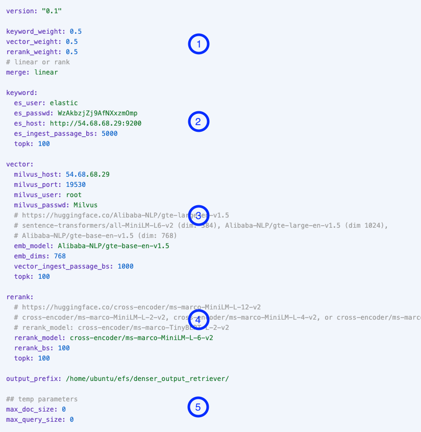

# Ingest and Retrieve

## Config Files

Denser retriever currently consists of three components: keyword search, vector search and reranker. We use [elasticsearch](https://www.elastic.co/) and [Milvus](https://milvus.io/) for the implementation of keyword search and vector search respectively. We aim to provide optimal **configurations** of these three components for different use cases.

Each configuration is reflected by a config file. We show a sample yaml configuration file as follows. Block 1 describes the weights for three components. Each of them takes weight of 0.5 in combining the results. The three components' weights are combined in linear method. We currently support linear or rank combination: which use the retrieval passage score or rank positions respectively.

Block 2, 3, and 4 describes keyword search, vector search, and rerank respectively. In keyword search, `es_user` and `es_passwd`

